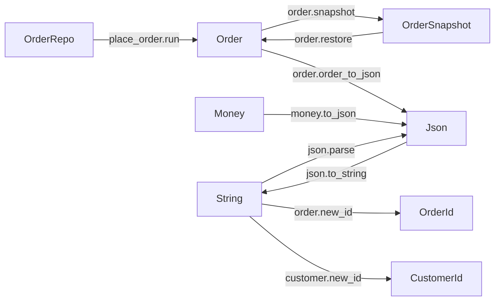

# Brainstorm: a tool for graphing type transforms across a Gleam codebase

Status: idea capture, not built. Worth coming back to — could be a
useful standalone open-source project AND a documentation aid for
this very book.

---

## What it does

Given a Gleam project (and optionally its dependencies), produce a
directed graph where:

- **Nodes** are types (`Order`, `OrderSnapshot`, `Json`, `String`, ...)
- **Edges** are functions that transform one type to another
  (`order.snapshot`, `order.restore`, `json.to_string`, ...)

Read the resulting graph as: "to convert an `X` into a `Y`, here's the
path of functions to compose."

## Why

- **Self-documentation**: at a glance, "how do values move through this codebase?"
- **Onboarding**: a new contributor sees the conversion paths between domain types
- **Architecture review**: spot accidental coupling, missing inverses (have `to_json` but no `from_json`)
- **Refactor planning**: identify isolated subgraphs, find transformation chains
- **Could embed diagrams in docs** — replace ASCII / hand-mermaid with auto-generated truth

## How

### Phase 1 — Parse

Use **`glance`** (Hex package, the community's standard Gleam AST
parser) to parse every `.gleam` file in:

- `src/` (always)
- `test/` (optional, with `--include-tests` flag)
- `build/packages/<each>/src/` (optional, with `--include-libs` flag)

Each file → a `glance.Module` containing `Definition`s.

### Phase 2 — Extract

Walk the AST, collecting:

- **Types**: module name + type name + variants + fields
- **Functions**: module + name + parameter list (with types) + return type + visibility
- **Type aliases** (for transparent traversal of newtype-style aliases)

Resolve qualified type names — `order.OrderSnapshot` (from another module) vs `OrderSnapshot` (defined locally) vs `OrderSnapshot` aliased via `import order.{type OrderSnapshot}`.

### Phase 3 — Build the graph

For each function `module.fn(p1: T1, p2: T2, ...) -> R`:

- One edge per parameter type → return type, labeled with `module.fn`
- Special handling:
  - **`Result(T, E)` return** — treat as `T` (success path is the transformation; error type is metadata, optionally rendered)
  - **`Option(T)` return** — same, treat as `T`
  - **`List(T)` return** with `List(S)` input — treat as `S → T` (container-preserving)
  - **Generic returns** — record as `→ a`; usually skip from visualization

Filter pragmatics (CLI flags):

- Drop edges where input and output are both stdlib primitives (String → String, Int → Int) — noise by default
- Drop edges where input/output is a stdlib type entirely (`--domain-only`)
- Include/exclude module patterns

### Phase 4 — Render

Output formats:

- **graphviz dot** — `dot -Tpng -o graph.png`
- **mermaid** — embed in markdown / GitHub
- **JSON** — `{ nodes: [...], edges: [...] }` for downstream tooling
- **CLI text** — sorted edge list for grepping

## CLI shape

```sh
type-graph                          # current project, src only, mermaid to stdout
type-graph --include-libs           # crawl build/packages too
type-graph --format=dot > g.dot     # graphviz output
type-graph --include "order*"       # only modules matching pattern
type-graph --exclude "test*"        # skip pattern
type-graph --domain-only            # drop stdlib-type edges
```

## Concrete output for *this* project would be something like



Reading the diagram tells you: to put an `Order` on disk, the path is
`Order → snapshot → OrderSnapshot → to_json → Json → to_string →
String → SQLite`. To get one back, reverse. Everyone's mental model
becomes the same picture, generated from the source of truth (the
code).

## MVP scope (first cut)

- Parse `src/` only
- Functions with one or more typed params, single return type
- Result / Option unwrap
- Mermaid + dot output
- Skip unresolvable qualified names (log a warning)
- Built-in primitive filter (`String`, `Int`, `Float`, `Bool`, `Nil`, `BitArray`)
- ~200–300 lines of Gleam, days of work for one dev

## Stretch

- **Library coverage** (parse `build/packages/*/src/`)
- **Type alias transparency** (`pub type UserId = String` is treated as transparent unless `--no-follow-aliases`)
- **Generic-aware nodes** (`List(Order)` distinct from `List(OrderSnapshot)`, with arrows between)
- **Inverse-pair detection** — flag types with `to_X` but no `from_X`
- **Test-coverage overlay** — highlight transforms not exercised by tests
- **Function-call inference** — detect when fn A actually *uses* fn B body-wise, to find indirect transforms (much harder; full call graph)
- **`gleam doc` integration** — embed the graph in the generated HTML docs

## Risks / hard parts

| Risk | Notes |
|---|---|
| **Qualified name resolution** | Imports like `import order.{type OrderSnapshot}` create aliases. Doable, just careful tracking. |
| **Generic types** | How to render `fn(List(a)) -> List(b)`? Multiple sensible answers; pick one as default. |
| **Multi-arg functions** | `fn(Order, Money) -> Order` — does Money "transform" Order? Pragmatic answer: yes, one edge per input type. |
| **Closures / inner functions** | Skip — only top-level public signatures matter for the high-level picture. |
| **Generated code (gleam_otp Subjects, etc.)** | Filter via blocklist or just accept the noise. |

## Implementation language

**Gleam itself, using `glance`**. Eats its own dogfood; runs anywhere
Gleam runs; idiomatic for the ecosystem.

## Existing prior art

Nothing for Gleam specifically AFAIK. Closest cousins:

- **Haskell**: `weeder`, `gtype-graph` (incomplete)
- **TypeScript**: `arkit`, `tsr`
- **Rust**: `cargo-deps`, `cargo-modules`
- **OCaml**: `odoc-ext` deps graphs
- **Java**: ArchUnit visualizations, jdeps

Gleam ecosystem has neither tools nor (yet) enough demand. Could be the
first.

## Recommended MVP demo

Run it on the gleam-katas project. Output a mermaid graph showing:

- The smart-constructor cluster: `String → Email`, `String → OrderId`, `String → CustomerId`
- The snapshot/restore symmetry: `Order ↔ OrderSnapshot`
- The JSON round-trip path: `Order → Json → String → Json → Order`
- The use-case orchestration: `OrderRepo + OrderId → Order` (via `place_order.run`)

If the diagram makes the architecture immediately legible to a new
reader, the tool has earned its place. Could become the recommended
way to embed the architecture diagram in chapter 10 of the book.

## Open questions before starting

- How does `glance` currently expose things — confirm the data shapes match expectations (e.g., are type-aliased imports tracked, or do we have to resolve manually?).
- What does the project's `gleam.toml` look like for tooling-only projects? (probably `target = "javascript"` is wrong for a CLI; want `target = "erlang"` since it produces a real binary, or use Gleam → JS → node for the CLI.)
- License — MIT/Apache-2 typical for Gleam ecosystem.

## Related ideas in the same neighborhood

- **A linter that flags missing `to_json`/`decoder` pairs** for opaque types — use the same parsing infrastructure
- **An auto-encoder/decoder generator** that emits boilerplate for any opaque type — overlaps with the LSP "Generate to-json" code action; could be a CLI alternative
- **A "boundary report" tool** — list every type that crosses a module boundary, useful for "where do I need decoders?"

All three would share the same `glance`-based parsing core.
